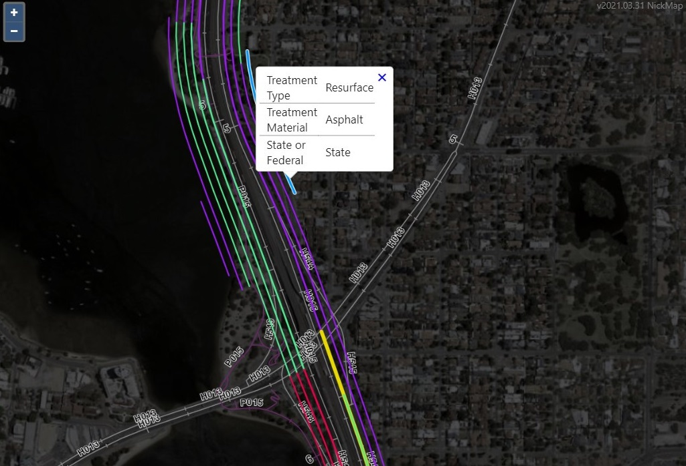

# NickMap - PowerBI Visual for GeoJSON

This visual will generate an interactive map for the kind of data shown in the following table:

| Point_Diameter | Label_Txt_1 | Label_Txt_2 | Line_Width |   Colour    |                  GeoJSON                   |
| :------------: | :---------- | :---------- | :--------: | :---------: | :----------------------------------------: |
|      `3`       | `"some"`    | `"other"`   |    `2`     | `"#FF0000"` | `{ "type":"Feature", "geometry":{ ... } }` |
|      `3`       | `"example"` | `"label"`   |    `3`     | `"#FFFF00"` | `{ "type":"Feature", "geometry":{ ... } }` |
|      `4`       | `"data"`    | `"stuff"`   |    `1`     | `"#FFAA00"` | `{ "type":"Feature", "geometry":{ ... } }` |
|      ...       | ...         | ...         |    ...     |     ...     |                    ...                     |

> PS: If you want to plot features on the Main Roads Western Australia road network based on (ROAD, START_SLK, END_SLK), you may be interested in my other project:
> https://github.com/thehappycheese/linear_referencing_geocoding_server
> which will help to generate the GeoJSON column.

The screenshot below shows a typical output:

## Usage Notes

### Field Wells
The "field wells" will accept the following data types:

| 'Field Well' Name   | Description of accepted columns                                                                                                                                                                                      | Data Type                   | Required | Max Columns | Default     | Example / Default                                                                         |
| ------------------- | -------------------------------------------------------------------------------------------------------------------------------------------------------------------------------------------------------------------- | --------------------------- | -------- | ----------- | ----------- | ----------------------------------------------------------------------------------------- |
| GeoJson Feature     | a single GeoJSON feature per row. Note: <ul><li>`"MultiGeometry"` is allowed</li><li>The `"properties"` field of input data is ignored</li><li>The coordinate reference system must be EPSG:4326 aka WGS84</li></ul> | Text / GeoJSON              | Yes      | 1           | `none`      | `'{ "type":"Feature", "geometry":{ type":"LineString", "coords":[[1,2],[3,4],[...]] } }'` |
| Popup Info          | columns containing the information to be shown in the popup when a feature is clicked in the map.                                                                                                                    | Any                         | No       | ∞           | `none`      | -                                                                                         |
| Colour              | a single hex formatted colour value per row.                                                                                                                                                                         | Text / Hex formatted colour | No       | 1           | `"#FF0000"` | `"#00FFFF"`                                                                               |
| Line Weight (px)    | a single number per row representing the desired line thickness of any `LineString` features drawn on the map.                                                                                                       | Number                      | No       | 1           | `1`         | `2`                                                                                       |
| Point Diameter (px) | a single number per row representing the desired diameter of any `Point` features drawn on the map.                                                                                                                  | Number                      | No       | 1           | `5`         | `30`                                                                                      |

### Settings

The following settings are available:

|Settings Page 1| Settings Page 2|
|--|--|
|||

Only MetroMap imagery and [OpenStreetMap](https://www.openstreetmap.org/) background layers are currently available.
Many others could be added if required.

## Future Improvements:

Please contact the author to suggest improvements! :)

Some ideas I have are:
  - Improve style options for point data; allow fill and maybe shape to be specified.
    - currently points are drawn as hollow circles with the same line style as LineStrings.
  - Improve style options for polygon data.
  - Make the map remember where you were last zoomed in on future visits to reduce confusion.
  - Integrate with PowerBI's integrated tooltip service which would give users much more flexibility to create custom tooltips.
  - Devise a way to generate colour categories using PowerBI's built in colour theme
    - This would alleviate the user from having to add a column to generate hex colour strings (not easy!)
    - This would reduce flexibility quite a lot though... I have no idea what colouring strategies the user might want; gradients, categories, bands etc.?
  - Don't hard-code layers into the visual, instead use a text input in the settings menu to allow entering the URL of the desired map services.

## Development Requirements

To work on this project the following are needed:

1) Install Node.js
   - Alternatively if you are an admin on your local machine I recommend https://github.com/coreybutler/nvm-windows which will make it easier to swap out node versions if necessary
2) Make sure `npm` (node package manager) is installed - Note this happens as part of the Node.js installation process and you should not need to do anything.
3) Open a terminal and install pbiviz `npm install pbiviz`
4) Install the pbiviz certificate `pbiviz --install-cert` following this guide: https://docs.microsoft.com/en-us/power-bi/developer/visuals/create-ssl-certificate
5) Clone or download this repo and open a terminal in the same folder where `package.json` is found
6) run `npm install` to automatically download all dependencies. This should create a folder called `node_modules`
7) Configure 'environments' (see section below)
8) run `pbiviz start`
9) Follow microsoft documentation to preview the developer mode visual https://docs.microsoft.com/en-us/power-bi/developer/visuals/visuals-how-to-debug
10) Install the secrets.json file as described below.
    - To make this visual compile, you must create a file inside the `./src/` directory called `.secrets.json`.
    - A template file is provided called `.secretes.example.json` which shows what should be in this file.
    - This is necessary to avoid uploading the map service URLs and API keys used by the layers in this visual.

